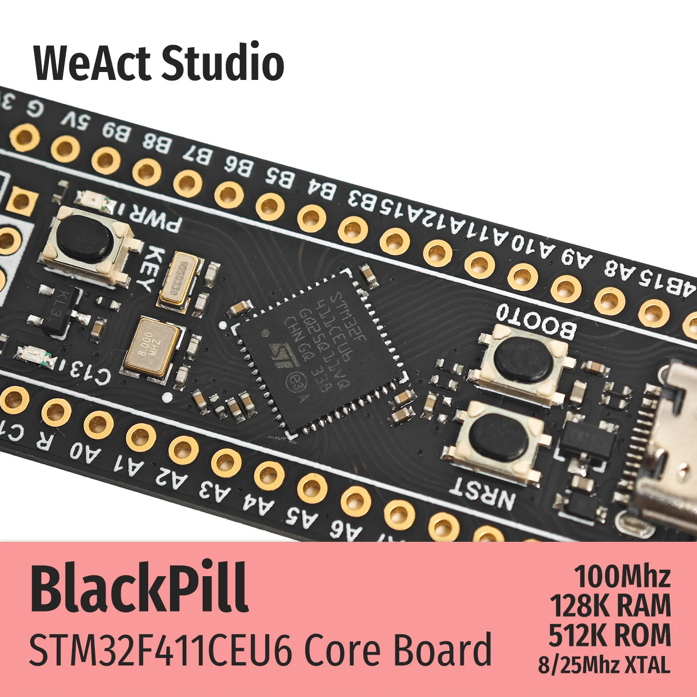
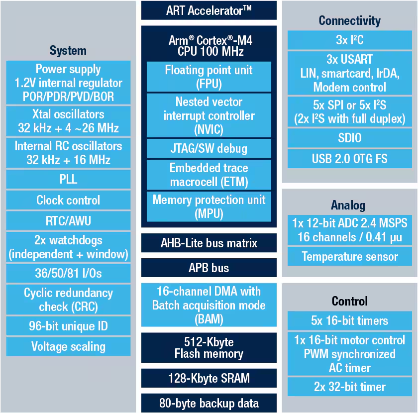

# STM32F411xE
Знакомство с MCU STM32F411xE на базе dev. board [WeAct BlackPill v3.1](https://aliexpress.ru/item/1005001456186625.html?sku_id=12000034304092618&spm=a2g2w.stores.seller_list.4.1c2447dccJJffq)

    

### [STM32F411xE](https://www.st.com/en/microcontrollers-microprocessors/stm32f411ce.html)

Устройства STM32F411xC/xE основаны на высокопроизводительном 32-разрядном RISC-ядре Arm® Cortex® -M4, работающем на частоте до 100 МГц. Ядро Cortex®-M4 оснащено модулем с плавающей запятой (FPU) одинарной точности, который поддерживает все инструкции и типы данных Arm одинарной точности. Оно также реализует полный набор команд DSP и модуль защиты памяти (MPU), что повышает безопасность приложений.

STM32F411xC/xE относится к линейке продуктов STM32 Dynamic Efficiency (продукты, сочетающие в себе энергоэффективность, производительность и интеграцию), в которую добавлена новая инновационная функция под названием Batch Acquisition Mode (BAM), позволяющая еще больше снизить энергопотребление при пакетной обработке данных.

STM32F411xC/xE оснащен высокоскоростной встроенной памятью (до 512 Кбайт флэш-памяти, 128 Кбайт SRAM) и широким спектром усовершенствованных устройств ввода-вывода и периферии, подключенных к двум шинам APB, двум шинам AHB и 32-разрядной матрице с несколькими шинами AHB.

Все устройства оснащены одним 12-разрядным АЦП, маломощным RTC, шестью универсальными 16-разрядными таймерами, включая один ШИМ-таймер для управления двигателем, и двумя универсальными 32-разрядными таймерами. Они также оснащены стандартным и усовершенствованным интерфейсами связи.

 

    

